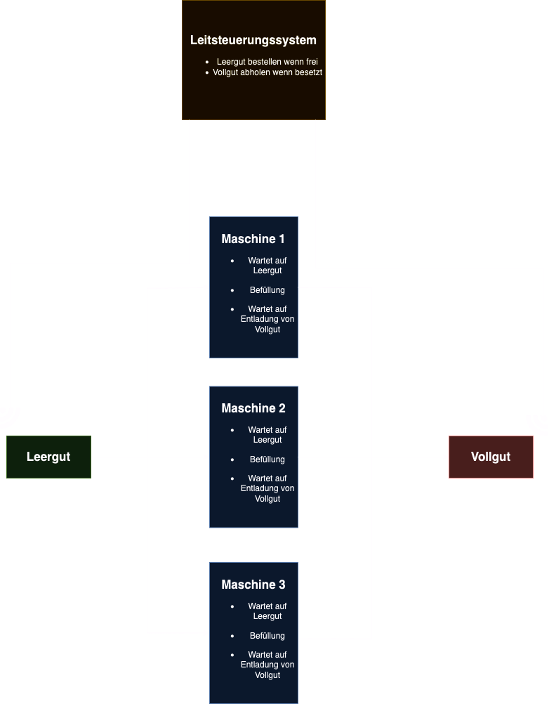

# ProdSim

Application for simulating the operations of a manufacturing station in a factory. The simulator is connected to a control system via an API and communicates with it to simulate the production process.

## System Overview

The factory has the following setup:

- "Empty Container Place" where empty containers are placed, and a "Full Container Place" where full containers are stored after production
- The factory has three machines that work concurrently. Each machine receives an empty container, "processes" it, and produces a full container.
- If the machines are perfectly synchronized, a full container would be produced every 1/3 of the production time.
- The "Empty Container Place" and "Full Container Place" are equipped with sensors that detect whether the place is occupied or free.
- The control system automatically orders a new empty container when the sensor at the "Empty Container Place" detects that it's free, and it initiates the retrieval of a full container when the sensor at the "Full Container Place" detects that it's occupied.
- The simulator's task is to simulate the switching of the occupied sensors based on the machines' operations: The "Empty Container Place" sensor is set to free when an empty container is loaded into a machine, and the "Full Container Place" sensor is set to occupied when a full container is produced by a machine.

## Implementation
Key components: 
- Simulator.java: Class that orchestrates the simulation and coordinates the machines 
- Machine.java: Representation of a single machine with the logic for loading, producing, and unloading.
